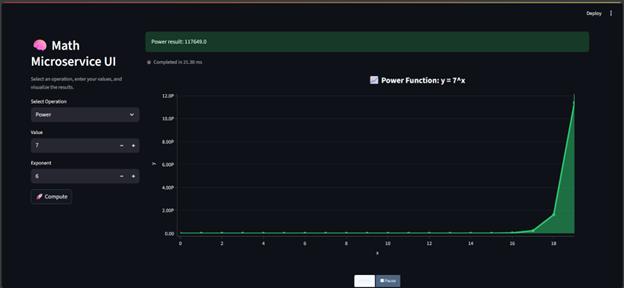
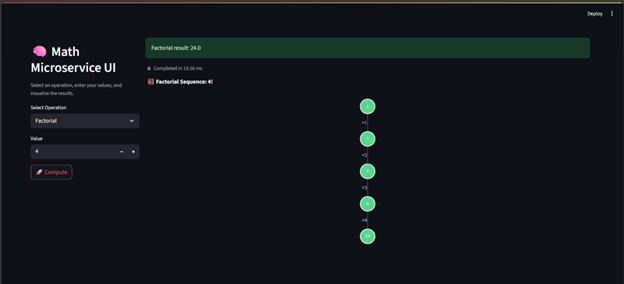
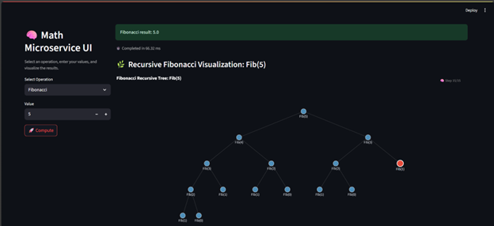

# 📐 Math-API-service

A modern Python microservice providing mathematical operations via FastAPI and an interactive Streamlit interface.

> Version controlled and visualized as of 2025-08-04.

---

## 🚀 Features

- `Power(base, exponent)`
- `Factorial(n)` – with concurrency
- `Fibonacci(n)` – with Redis caching
- Streamlit UI with animations for each operation
- SQLite-backed operation logging
- Dockerized deployment and development

---


## 🖼️ Visual Previews

### Power Function  


### Factorial  


### Fibonacci  


---

## 🛠 Tech Stack

- **Backend**: FastAPI, SQLAlchemy, SQLite
- **Frontend**: Streamlit, Plotly
- **Infra**: Docker, Docker Compose
- **Cache**: Redis
- **Testing & Linting**: flake8

---

## 🧪 Local Dev Setup

```bash
git clone https://github.com/BogdanTibuleac/Math-API-service.git
cd Math-API-service
docker-compose up --build
```

- Swagger UI: http://localhost:8000/docs
- Streamlit UI: http://localhost:8501

---

## 📂 Folder Layout

```
.
├── main.py                 # FastAPI backend
├── streamlit-ui/           # Streamlit interface
├── media/                  # Visual diagrams
├── data/, __pycache__/     # Storage + cache
├── requirements.txt
├── docker-compose.yaml     # Multi-service config
├── .flake8, .gitignore     # Lint & ignore rules
```

---

## 📈 Future Enhancements

- JWT-based authentication
- Rate limiting
- Historical stats dashboard
- CI/CD via GitHub Actions

---

