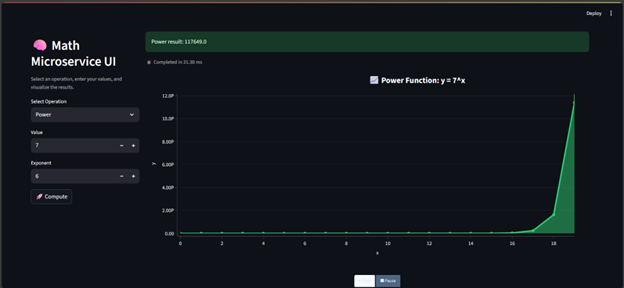
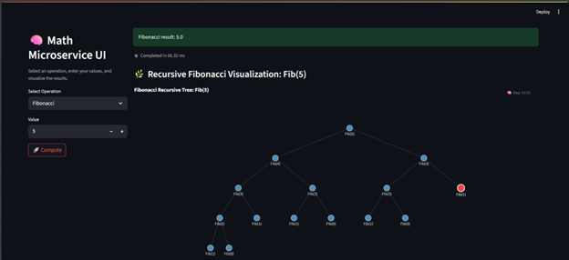
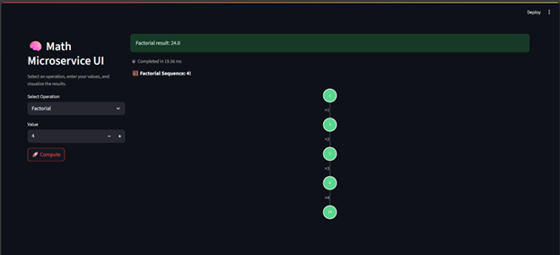

# 🧠 Math Microservice

A FastAPI-based microservice for computing **power**, **fibonacci**, and **factorial** operations. Includes Redis caching, SQLite logging, and a Streamlit UI for interactive visualization.

---

## 🔧 Tech Stack

- **Backend:** FastAPI, SQLAlchemy, Redis, SQLite
- **Frontend:** Streamlit + Plotly
- **Async:** ThreadPoolExecutor for heavy factorials
- **Cache:** Redis (1h TTL for Fibonacci)
- **DB:** Logs all operations in SQLite

---


## 🚀 Usage

### Run Locally

```bash
# Start Redis (if not running)
docker run -d -p 6379:6379 redis

# Install deps
pip install -r requirements.txt

# Start API
uvicorn main:app --reload

# Start UI
streamlit run app.py

```
## 📸 UI Visualizations

### Power Function


### Fibonacci Visualization


### Factorial Chain


